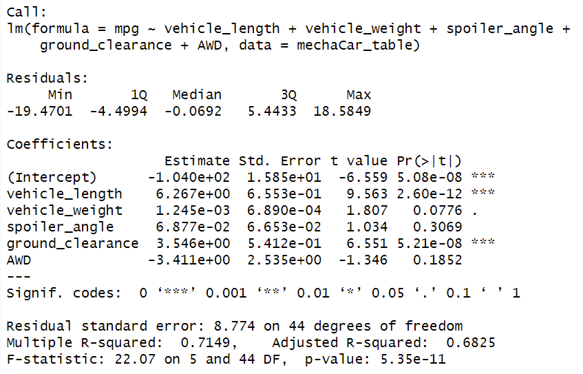
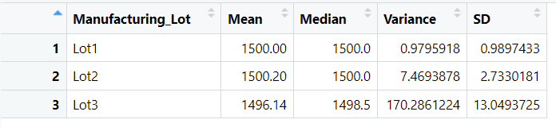
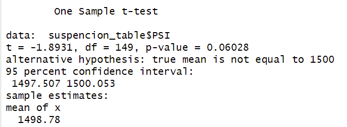
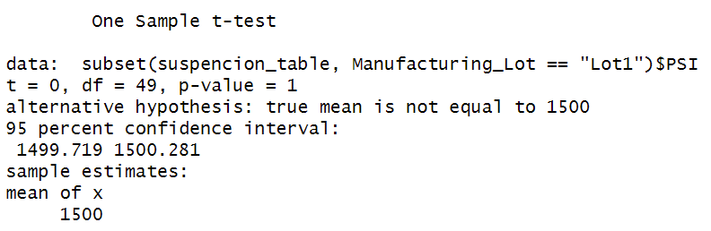
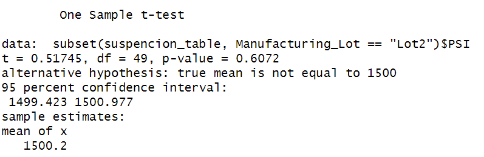
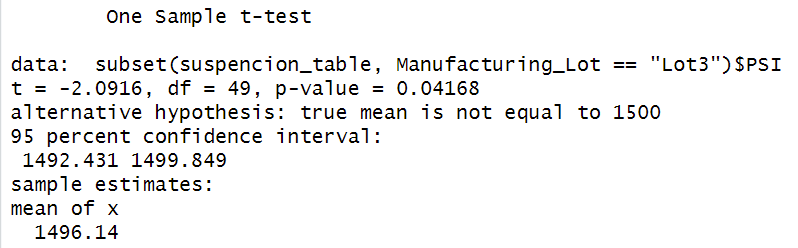

# MechaCar_Statistical_Analysis

## Linear Regression to Predict MPG

For our first analysis, we used the MechaCar_mpg dataset that contained the mpg test results for 50 prototype MechaCars. The MechaCar prototypes were produced using multiple design specifications to identify ideal vehicle performance. Multiple metrics, such as vehicle length, vehicle weight, spoiler angle, drivetrain, and ground clearance, were collected for each vehicle. Using our knowledge of R, we designed a linear model that predicted the mpg of MechaCar prototypes using several variables from the file. From our results, vehicle length and ground clearence provided a non-random amount of variance to the mpg values in the dataset as you can see from our table above. For our slope we got 5.34e-11 wich is much less than 0.05 so it is not considered to be zero. Finally, the linear model did predict the mpg of MechaCar prototypes effectively as our multiple r-squared was 0.7149.

## Summary Statistics on Suspension Coils

For our second analysis, we used the MechaCar Suspension_Coil dataset that contained the results of multiple production lots. In this dataset, the weight capacities of multiple suspension coils were tested to determine if the manufacturing process was consistent across production lots. Using our knowledge of R, we created the two summary statistics tables above to show the suspension coil’s PSI continuous variable across all manufacturing lots and for each one. For all manufacturing lots, the data did meet the design specification of the variance of the suspension coils not exceeding 100 pounds per square inch. For each lot, 1 and 2 also acommplished the same, however 3 did not as it had 70 more.

## T-Tests on Suspension Coils

For our third analysis, we performed t-tests to determine if all manufacturing lots and each lot individually are statistically different from the population mean of 1,500 pounds per square inch.

For all of our lots, the p-value is 0.06028 which means PSI across all manufacturing lots is statistically similar from the population mean of 1,500 pounds per square inch

For lot one, the p-value is 1 which means PSI across all manufacturing lots is statistically similar from the population mean of 1,500 pounds per square inch

For lot two, the p-value is 0.6072 which means PSI across all manufacturing lots is statistically similar from the population mean of 1,500 pounds per square inch

For lot three, the p-value is 0.04168 which means PSI across all manufacturing lots is statistically different from the population mean of 1,500 pounds per square inch

## Study Design: MechaCar vs Competition

